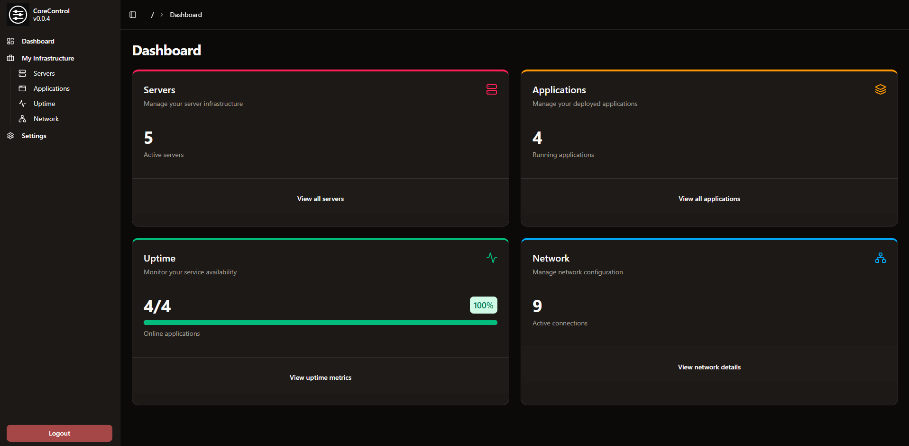

# CoreControl

<figure><figcaption></figcaption></figure>

CoreControl is the only dashboard you'll ever need to manage your entire server infrastructure. Keep all your server data organized in one central place, easily add your self-hosted applications with quick access links, and monitor their availability in real-time with built-in uptime tracking. Designed for simplicity and control, it gives you a clear overview of your entire self-hosted setup at a glance.

## Features

* Dashboard: A clear screen with all the important information about your servers (WIP)
* Servers: This allows you to add all your servers (including Hardware Information), with Quicklinks to their Management Panels
* Applications: Add all your self-hosted services to a clear list and track their up and down time
* Networks: Generate visually stunning network flowcharts with ease.
