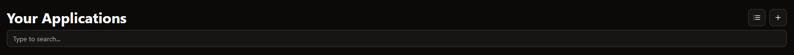

# Applications

All your self-hosted applications are displayed here.

## Add an application

To add a new application to CoreControl, follow these steps:

1. Click the "Add Application" button in the top right corner of the server menu:
   

2. Fill out the server details across the following information:

- **Name**: Enter the name of the application
- **Server**: Select the server on which the application is running
- **Description**: Enter a short (or long) description of the server
- **Icon URL**: Add the url pointing to the logo of the application. With the flash button the logo will be automatically selected.
- **Public URL**: Enter the public URL of your application. This will be used to track the uptime.
- **Local URL**: Enter the local URL of your application, i.e. the URL via which the application is only accessible in the local network

After filling out the required information, click "Add" to add the application to CoreControl.

## Application Display
Your applications are displayed in a list or grid (depending on the display settings) - each application in its own card
