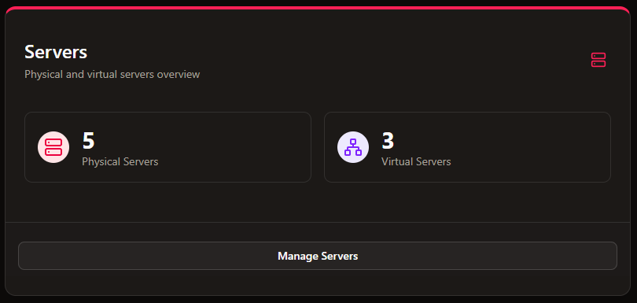
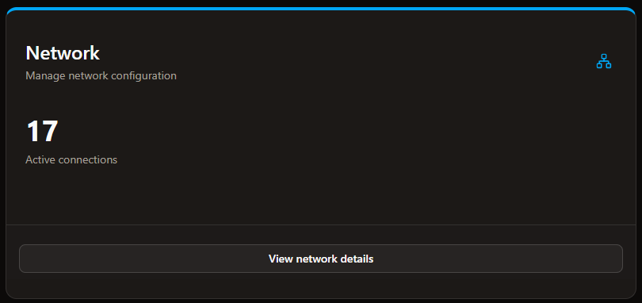

# Dashboard

The dashboard is the most important place to get a quick overview of your infrastructure.

## Cards Overview
The dashboard is divided into 4 cards that provide different aspects of your infrastructure monitoring:

### Servers Card

The Servers card displays information about all your connected servers, including:
- Number of Physical Servers
- Number of Virtual Servers

### Applications Card

The Applications card shows you:
- Number of running applications across your infrastructure

### Uptime Card

The Uptime card provides:
- Number of online applications

### Network Card

The Network card displays:
- Sum of servers and applications