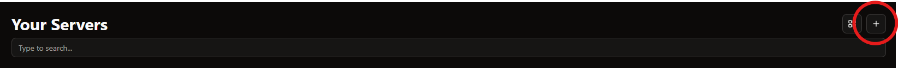
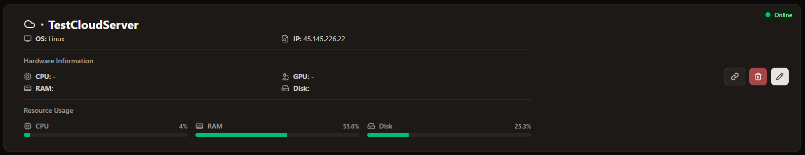
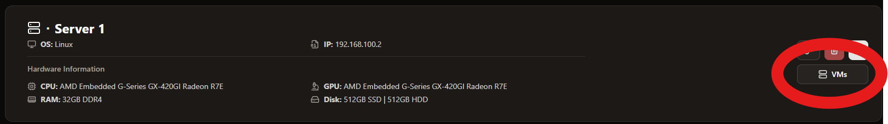
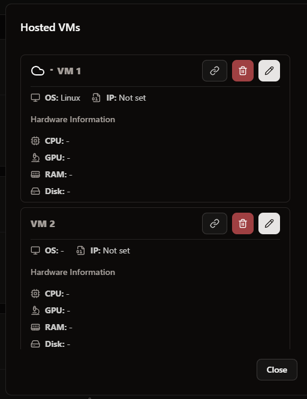

# Servers

In the server menu you can see all your servers and add more if required

## Add a Server
To add a new server to CoreControl, follow these steps:

1. Click the "Add Server" button in the top right corner of the server menu:
   

2. Fill out the server details across the following tabs:

### General Tab
Configure the basic server information:
- **Icon**: Choose a custom icon for your server
- **Name**: Enter a descriptive name for the server
- **Operating System**: Select the server's operating system
- **IP Address**: Enter the server's IP address
- **Management URL**: Add the URL used to manage the server (optional)

### Hardware Tab
Specify the server's hardware specifications:
- **CPU**: Enter CPU model and specifications
- **GPU**: Add graphics card details if applicable
- **RAM**: Specify the amount of RAM
- **Disk**: Enter storage capacity and configuration

### Virtualization Tab
Configure virtualization settings:
- **Host Server Settings**:
  - Enable "Host Server" if this server will host virtual machines
  - Perfect for hypervisors like Proxmox, VMware, or similar
- **VM Settings**:
  - Select a host server if this server is a virtual machine
  - This creates a logical connection between the VM and its host

### Monitoring Tab
Set up server monitoring options (see "Monitoring" section for detailed information)

After filling out the required information, click "Add" to add the server to CoreControl.

## Monitoring

If you want to monitor the hardware usage and status of your servers, you will have to enable monitoring in the monitoring tab.

After you have done this you need to install [Glances](https://github.com/nicolargo/glances) on the server. To help you with this, we have created a sample compose that you can simply copy. For detailed customizations, please refer to the [Glances docs](https://glances.readthedocs.io/en/latest/).

```yaml
services:
  glances:
    image: nicolargo/glances:latest
    container_name: glances
    restart: unless-stopped
    ports:
      - "61208:61208"
    pid: "host"
    volumes:
      - /var/run/docker.sock:/var/run/docker.sock:ro
    environment:
      - GLANCES_OPT=-w --disable-webui
```
::: warning
Please also make sure that CoreControl can reach the specified API URL of Glances. In addition, the Glances API URL should be specified in the format `http://<IP_OF_SERVER>:61208`.
:::

## Server Display
Your servers are displayed in a list or grid (depending on the display settings) - each server in its own card


There are also three action buttons at the end of each card.
- Link Button - With this you can open the specified management URL of the server with one click
- Delete Button - Direct deletion of the server
- Edit Button - Customize the server with the same menu as when creating the server

## VMs
If a host server contains VMs, you can display them using the “VMs” button


The associated VMs are then displayed in a clearly arranged list.
