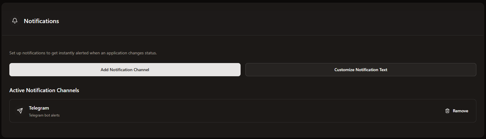

# Notifications
You can set the notifications for CoreControl in the settings. These notifications include when an application goes online or offline and when a server goes online or offline.

You can also customize direct notification texts and improve them with placeholders